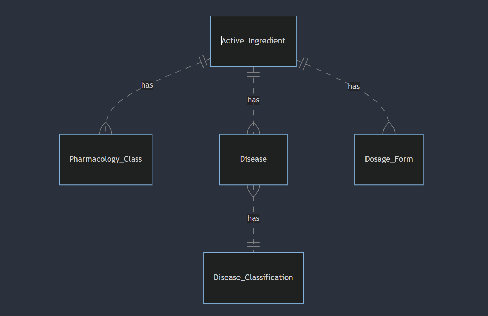

# Design Document

    By Ahmed Shawky

Video overview: <[https://www.youtube.com/watch?v=NAUXihjXE1k]>

## Scope

* This database was designed for managing information related to pharmaceutical drugs and their uses to treat diseases.

* Scope
    Things:
        Active ingredients: Chemical substances used in medications (e.g., Aspirin, Ibuprofen)
        Pharmacology classes: Categories of drugs based on their mechanism of action (e.g., Analgesics, Anti-inflammatory drugs)
        Diseases: Medical conditions that the drugs are intended to treat (e.g., Headache, Fever)
        Dosage forms: The physical form of the medication (e.g., Tablet, Capsule, Syrup)
        Disease classifications: Categorization of diseases based on their characteristics (e.g., Infectious, Non-infectious)

*   The database doesn't include information about specific patients, their medical history, or dosages prescribed.
    Real-time drug availability, pricing, or manufacturer details might not be included.
    Information about the safety and efficacy of specific drug combinations or interactions might not be directly stored in this database.

## Functional Requirements

* Within the scope:
    Search for active ingredients: Users could search for specific ingredients by name or chemical formula.
    Browse pharmacology classes: They could explore different categories of drugs based on their mechanism of action.
    Find information about diseases: Users could look up details about specific diseases, including their classification (infectious or non-infectious).
    Investigate relationships: They could explore how active ingredients are linked to pharmacology classes, diseases, and dosage forms.
    View pre-defined reports: Users might be able to access pre-built views like "ActiveIngredientDetails" and "DiseaseClassificationWithDiseases" for summarized information.

* Beyond the scope:
    Diagnose or treat medical conditions: This database is not intended for medical diagnosis or treatment advice. Consulting a qualified healthcare professional is crucial for any medical concerns.
    Prescribe or administer medication: The database doesn't contain information about specific dosages or suitability for individual patients. Only licensed medical professionals can prescribe medications.
    Modify or manage patient data: This system likely doesn't have functionalities for managing patient information or electronic health records.
    Perform complex data analysis or research: The database might not be equipped for elaborate data analysis or in-depth scientific research related to drug interactions, efficacy, or safety.

## Representation

Entities are captured in SQLite tables with the following schema.

### Entities

Active Ingredient: Represents the chemical substance with therapeutic effects in a medication.
Pharmacology Class: Represents a category of drugs based on their mechanism of action (how they work).
Disease: Represents a medical condition that the drugs are intended to treat.
Dosage Form: Represents the physical form of the medication (e.g., tablet, capsule).
Disease Classification: Represents a categorization of diseases based on their characteristics (e.g., infectious, non-infectious).

### Attributes

* Active Ingredient "active_ingredient":
    'id': Unique identifier for the ingredient.
    'IngredientName': Name of the active ingredient.
    'ChemicalFormula': Chemical formula of the ingredient.
    'PharmacologyClassID': Foreign key referencing the Pharmacology class it belongs to.
    'DiseaseID': Foreign key referencing the Disease it can be used to treat.
    'DosageFormID': Foreign key referencing the Dosage form it can be available in.

* Pharmacology Class "pharmacology":
    'id': Unique identifier for the class.
    'ClassName': Name of the pharmacology class.

* Disease "disease":
    'id': Unique identifier for the disease.
    'DiseaseName': Name of the disease.
    'Class': Foreign key referencing the Disease Classification it belongs to.

* Dosage Form "dosage":
    'id': Unique identifier for the dosage form.
    'DosageFormula': Description of the dosage form.

* Disease Classification "DiseaseClassification":
    'id': Unique identifier for the classification.
    'Class': Name of the disease classification.
    'type': Type of the disease (infectious or non-infectious).

    * Primary Keys: Each table has a unique identifier ('id') to ensure each entity is distinct and easily referenced.
    * Foreign Keys: Foreign keys connect related entities (e.g., ActiveIngredient.PharmacologyClassID references Pharmacology.id). This helps maintain data integrity and prevents inconsistencies.
    * NOT NULL constraints: Certain attributes ('IngredientName', 'ChemicalFormula', 'ClassName', 'DiseaseName', 'DosageFormula', 'Class') cannot be null to ensure essential information is always present.
    * UNIQUE constraint: 'DiseaseName' is unique to prevent duplicate entries for the same ingredient.
    * CHECK constraint: 'type' is restricted to "infectious" or "non-infectious" to enforce valid disease type information.

### Relationships

As detailed by the diagram:

1. Active Ingredient - Pharmacology Class: Relationship: One-to-Many : An active ingredient can belong to one pharmacology class, but a pharmacology class can have many active ingredients.
2. Active Ingredient - Disease: Relationship: One-to-Many : An active ingredient can be used to treat many diseases, but a disease can be treated by many different active ingredients.
3. Active Ingredient - Dosage Form: Relationship: One-to-Many : An active ingredient can be available in many dosage forms, but a dosage form can contain many different active ingredients.
4. Disease - Disease Classification: Relationship: Many-to-One : One disease classification can group many diseases, but a disease can only belong to one classification.

## Optimizations

* indexes:
1. ai_search on active_ingredient: This composite index includes both IngredientName and ChemicalFormula. This helps in faster searches when users query the database using these attributes, especially when combined (e.g., searching for an ingredient by both name and formula).
2. disease_search on disease: This index on DiseaseName facilitates efficient searches for diseases by name.
3. pharma_search on pharmacology: This index on ClassName allows for quicker searches for pharmacology classes by name.

* views:
1. ActiveIngredientDetails: This view combines data from active_ingredient, pharmacology, and disease tables, offering a consolidated view of active ingredient details (name, formula, class name, and disease name). This view can be used to readily access this combined information without requiring complex joins in user queries.
2. DiseaseClassificationWithDiseases: This view connects DiseaseClassification with disease tables, presenting disease names along with their classification details (class and type). This view simplifies retrieval of disease-related information by offering it in a pre-joined format.

## Limitations

In this section you should answer the following questions:

* Limitations of the current design:
it lacks details like:
1. Drug interactions: The system doesn't represent potential interactions between different medications, a crucial aspect of medication safety.
2. Dosage recommendations: The database doesn't include specific dosage information for different patients or conditions, which is vital for safe and effective medication use.
3. Contraindications: Information about conditions or medications that shouldn't be used together isn't directly represented.
4. Side effects: The database doesn't capture potential side effects of the medications.

* What the database might not represent well:
1. Patient-specific factors: Age, weight, medical history, and other patient-specific aspects significantly influence medication decisions, which are not captured.
2. Treatment protocols: The database doesn't represent established treatment protocols for specific diseases, which are crucial for guiding medication use in clinical settings.
3. Pharmacodynamics and pharmacokinetics: The design doesn't delve into the mechanisms of how drugs work within the body (pharmacodynamics) or their absorption, distribution, metabolism, and excretion (pharmacokinetics).
